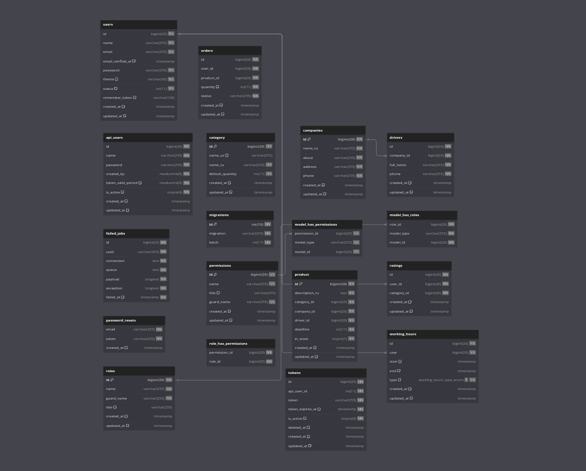

## Database

<a align="center" style="display:flex;justify-content:center; background:black; padding:10px; border-radius:10px;" href="https://dbdiagram.io/d/6493408c02bd1c4a5edc032e">Link to db</a>
___

Laravel is accessible, powerful, and provides tools required for large, robust applications.
# Laravel 8 & AdminLte 3.0 & RBAC

## Login

                'name' => 'Super Admin',
                'email' => 'superadmin@example.com',
                'password' 'password',
             
                'name' => 'Manager',
                'email' => 'manager@example.com',
                'password' 'password',
  
                'name' => 'Employee',
                'email' => 'employee@example.com',
                'password' 'password',
   